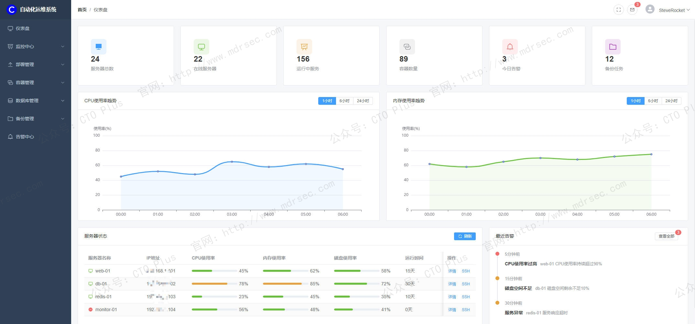
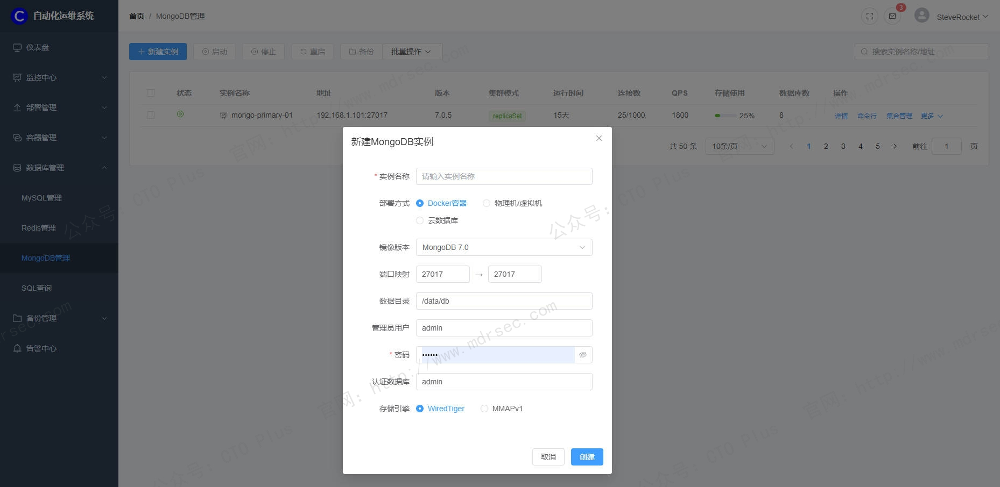
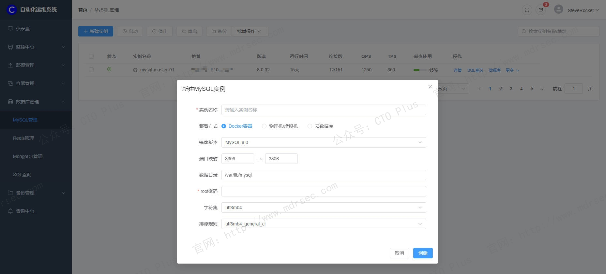
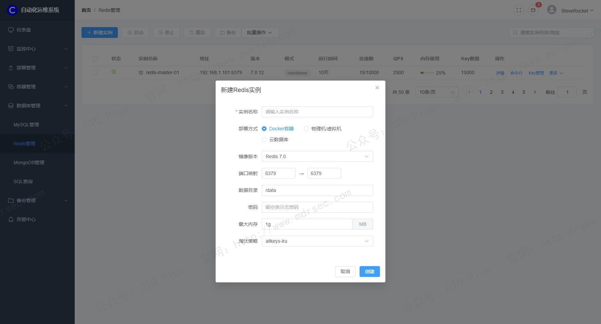
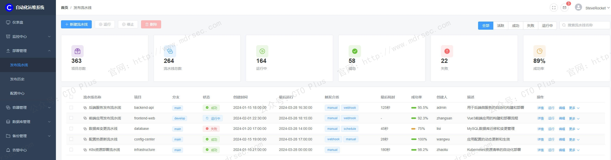
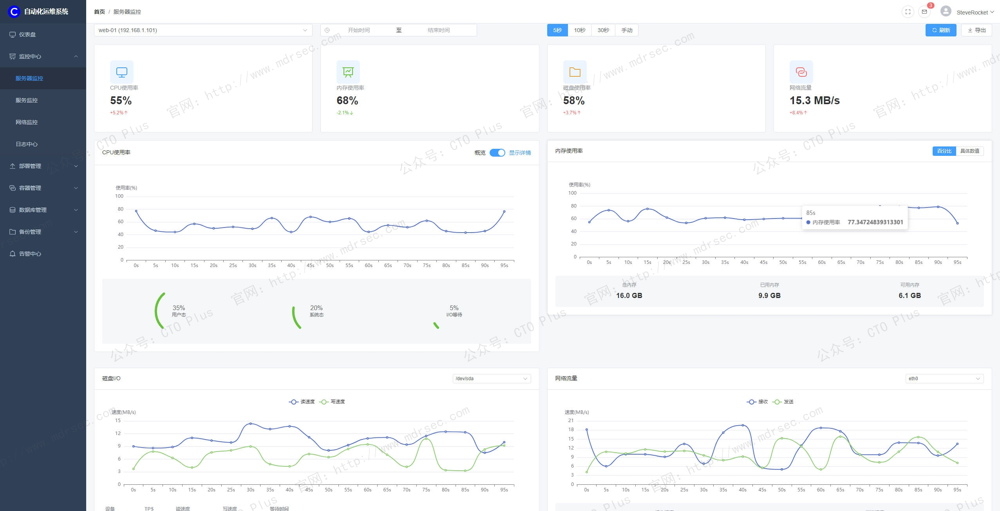
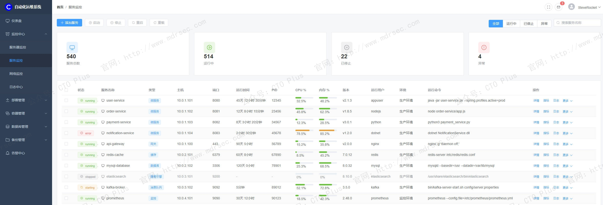

# 自动化运维系统（AutoOps）

## 关于我们

- 官网： http://www.mdrsec.com

我们的技术文章和产品概述欢迎浏览我们的门户。

- 公众号：CTO Plus

最新的动态欢迎关注我们官方唯一公众号。

- 作者QQ

更详细更具体的需求，或者项目合作，或者问题 欢迎联系我。

- QQ群

我们官方组建的QQ群，如果您有兴趣也可以加入我们。

- 请喝咖啡

如果感兴趣，也可以请我喝杯咖啡

## 产品核心功能模块

企业IT基础设施已从传统的“物理机+单一应用”演变为“多云/混合云+微服务+容器化”的极度复杂架构。服务器数量从几十台暴增至成千上万台，应用迭代周期从天级压缩至小时级。这种规模与速度的指数级增长，使得依赖人工登录服务器敲命令的传统运维模式彻底失效——不仅效率低下、响应迟缓，更因人为误操作埋下了巨大的安全隐患。

我们在为企业运维部门开发的企业级自动化运维系统（AutoOps）绝非简单的脚本集合或单点工具，而是一套贯穿**“感知-分析-决策-执行”**全链路的体系化平台。AutoOps 的核心任务是：**将运维人员从重复、繁琐、低价值的“救火队员”劳动中解放出来，通过标准化、自动化、智能化的手段，实现IT基础设施全生命周期的可视、可控、可审计**，最终驱动业务稳定性与交付效率的双重跃升 。

在这，我将为大家介绍下我们自研的 企业级自动化运维系统（AutoOps） 核心功能模块与产品特性

有问题和需求欢迎联系我们。

## AutoOps 核心功能架构总览

我们的AutoOps 系统采用分层解耦的模块化架构，各层之间通过标准化API协同工作。从产品逻辑上看，我们划分为**基础管理层、自动化执行层、智能感知层、协同控制层**四大核心支柱。

| **架构层级**   | **核心模块**            | **关键能力抽象**                   |
|:-----------|:--------------------|:-----------------------------|
| **协同控制层**  | CMDB、ITSM、统一门户      | **“大脑”** ：负责元数据定义、流程审批与入口统一。 |
| **智能感知层**  | 统一监控、告警中心、日志分析      | **“眼耳”** ：负责状态感知、数据汇聚与异常检测。  |
| **自动化执行层** | 脚本管理、作业编排、定时调度、配置管理 | **“手脚”** ：负责任务拆解、批量执行与配置落地。  |
| **基础管理层**  | 资产管理、账号权限、安全合规      | **“骨骼”** ：负责资源纳管、身份认证与安全保障。  |

接下来是各模块的具体功能与产品特性。

## 基础管理层：构建标准化与安全的运维基础

自动化并不意味着“无序”，相反，越高的自动化程度越依赖严格的资产登记与权限约束。

### 1. 资产与配置管理

这是我们 AutoOps 的**唯一事实来源**。平台需具备强大的**自动发现**能力，能够通过Agent或Agentless方式（如SSH、SNMP、API）自动识别并纳管混合云环境下的全量资源（物理机、虚拟机、容器、中间件、网络设备等），形成动态更新的**配置管理数据库（CMDB）** 。

- **核心特性**：对象模型支持自定义扩展，能够映射企业复杂的业务层级关系（如“某业务线 -> 某集群 -> 某服务 -> 某主机”）。所有自动化操作的“目标对象”均来源于此，确保执行范围的精准无误 。

### 2. 账号、权限与审计

我们 AutoOps 掌握着基础设施的权威可信数据，因此**特权访问管理**是产品安全生命线。系统支持接入企业统一的SSO认证体系（如LDAP/AD），并实现细粒度的**RBAC角色权限控制**。

- **核心特性**：遵循**最小权限原则**，严格区分“脚本查看者”、“作业执行者”与“平台管理员”。针对核心资产的操作，内置**多级审批流程**（如双人复核）。
- **合规性保障**：对所有高危操作（如数据库删库、系统关机）进行**实时录屏与指令审计**，确保每一次按键都可追溯、可回放、可定责，满足等级保护与SOX合规要求 。

### 3. 参数中心

解决“配置漂移”的利器。运维中大量的操作差异仅在于参数不同（如IP地址、环境变量）。

- **核心特性**：建立全局统一的参数仓库，支持加密存储敏感信息（如密码、Token）。在执行自动化任务时，通过变量引用而非硬编码的方式注入参数，确保脚本在开发、测试、生产多环境间无缝流转，兼顾效率与安全 。

## 自动化执行层：驱动大规模任务的高效引擎

这直接决定运维效率的成色，核心在于**批量、并发、编排**。

### 1. 脚本与作业管理

我们的平台能够构建企业级的**脚本图书馆**，对散落在运维人员个人电脑里的Shell、Python、Perl脚本进行集中纳管、语法校验、版本控制与安全扫描。

- **作业编排**：将单一脚本原子化为“任务节点”，通过**可视化拖拽界面**编排成复杂的作业流。支持串行、并行、条件分支（如“A主机执行失败则暂停流程”）及错误重试机制。
- **执行模式**：支持针对海量主机的**分批执行策略**（如“先灰度5%，观察无异常后再全量发布”），最大限度规避变更风险 。

### 2. 定时调度引擎

替代Linux Crontab的分散式管理，实现**集中化、高可用**的任务调度。

- **特性**：支持Cron表达式精确控制周期（秒级至年级）。能够将脚本执行、文件分发、数据备份等任务固化为例行工单，执行结果自动通知责任人，彻底解放凌晨值班的人力投入 。

### 3. 配置自动化

不仅仅是执行命令，更是**声明式状态管理**。系统通过Playbook或配置管理组件，确保服务器始终维持在定义的“基线状态”。

- **应用场景**：新机器上线后的**初始化**（装Agent、挂载硬盘、优化内核）；大规模集群的**配置一致性检查**（如Nginx配置、SSH配置加固）。一旦检测到偏离基线，系统可自动触发修复动作，实现**闭环合规** 。

## 智能感知层：从被动救火到主动预警

我们的 AutoOps 深度融合监控与AI能力，这里与我们的**AIOps**平台形成深度集成。

### 1. 全景监控与日志中心

作为数据底座，AutoOps 支持整合或对接三大数据源：

- **指标监控**：纳管Prometheus/Zabbix等数据源，实时采集CPU、内存、网络吞吐等时序指标。
- **日志分析**：提供统一的日志采集器，对分布式系统产生的海量日志进行结构化解析、秒级检索与上下文关联，快速定位调用链路中的异常节点 。
- **调用链追踪**：在微服务架构下，可视化展示请求经过的每一跳服务耗时，精准定位性能瓶颈。

### 2. 智能告警与根因分析

传统监控最大的痛点是“告警风暴”（一台宿主机宕机导致上百条虚拟机告警）。

- **告警治理**：AutoOps 需内置**告警降噪算法**（如空间收敛、时间归并、依赖拓扑推导），将杂乱无章的告警聚合为一条精准的**事件**。
- **AI根因分析**：基于运维知识图谱与关联算法，系统应能自动推断出故障的根本原因（如“因A数据库慢查询导致B应用线程池满”），并推荐最佳处置方案，将MTTR（平均修复时间）从小时级压缩至分钟级 。

## 协同控制层：连接人与系统的服务化网关

运维的本质是服务，AutoOps 在体验设计上来连接技术、流程与人。

### 1. 一体化门户

提供统一的操作控制台，打破工具割裂。运维人员在一个页面内即可完成“收到告警 -> 查询日志 -> 关联CMDB -> 执行修复作业”的全流程闭环，无需切换多个工具窗口。

### 2. ITSM与变更管理联动

我们的 AutoOps 系统与企业ITSM（IT服务管理）流程深度融合：

- **自动开单**：监控触发故障后，自动创建事件单。
- **变更关联**：自动化作业必须挂载在相应的**变更单**下执行，作业结束后自动回填执行结果并关闭工单。这种**“凡操作必留痕”**的机制是保障生产环境稳定性的制度护城河 。

### 3. ChatOps

将运维操作下沉至企业微信、钉钉、飞书、Slack、自研IM工具等日常沟通界面。通过“对话即运维”的交互模式，研发人员无需登录VPN和控制台，在聊天窗口@机器人即可完成服务重启或日志查询，极大降低了运维触达门槛 。

## 最后

1. **从自动化到自治化**：不再仅仅是按照预设脚本机械执行，而是具备**故障自愈**能力（如CPU飙升自动扩容，磁盘满自动清理日志），实现无人值守的弹性架构 。
2. **成本洞察与FinOps**：AutoOps 开始承担**降本增效**的财务职责，通过对资源利用率的智能分析，自动识别闲置资源并触发缩容/降配建议，让运维数据直接创造业务价值 。
3. **混沌工程集成**：主动通过故障注入检验系统的韧性，验证自动化容灾预案的有效性，从“害怕故障”转向“拥抱不确定性” 。

我们的企业级 AutoOps 产品是一套**“闭环操作系统”** ：向下无缝纳管异构基础设施，向上提供抽象化的服务API，中间贯穿严格的合规审计与智能算法。它不仅是工具，更是保障企业核心业务连续性、提升研发效能、支撑数字化转型不可或缺的战略资产。

如有需求和问题欢迎联系咨询我们。 http://www.mdrsec.com

## 产品清单

### 企业网络安全运营中心产品

- 资产安全配置管理系统（SCMDB）
- 终端侦测与响应系统（EDR）
- 网络侦测与响应系统（NDR）
- 企业网络资产攻击面管理系统（CAASM）
- 资产暴露面管理系统（AEMS）
- 网络安全蜜罐管理系统（HoneyPot）
- 安全事件收集与告警管理系统（SIEM）
- 扩展侦测与响应系统（XDR）
- 多引擎脆弱性扫描系统（VAS）
- 多源日志审计监测系统（LAS）
- 网络安全威胁情报中心（TIS）
- 网络安全漏洞库管理系统（VDBS）
- 网络安全编排与自动化响应（SOAR）
- 威胁狩猎系统（THS）
- 数据库安全审计系统（DSAS）
- AI智能体安全态势管理系统（AISPM）
- Web防火墙（WAF）
- 网站安全监测平台（WSM）
- 网络安全态势感知平台（SSAP）
- 网络安全自动化应急响应工具系统（NSRT）
- 企业网络安全运维工具系统（SecTools）
- 网络安全自动化等保测评系统（ASES）
- 浏览器安全监测防护系统（BSMPS）
- 网络安全用户实体行为分析系统（UEBA）
- 互联网电信诈骗预警防护系统（TPFWS）
- 云原生安全管理平台（CNAPP）
- 自动化渗透测试系统（PTS）
- 工业企业信息安全监测中心（IoT SOC）
- 企业智能安全运营中心（AISOC）

### 企业自动化运维产品

- 运维智能监控告警管理平台（AIMAMS）
- 企业网络工具系统（NTools）
- 自动化测试系统（AutoTest）
- 自动化运维系统（AutoOps）
- 企业运维工具系统（OpsTools）
- 物联网管理系统（IoTS）
- 软件开发生命周期管理系统（SDLC）
- IT流程管理系统（ITSM）

### 企业数字化运营资源管理系统产品

- 制造执行管理系统（MES）
- 运输管理系统（TMS）
- 跨境电商企业资源管理系统（ERP）
- 企业客户关系管理系统（CRM）
- 跨境电商仓库管理系统（WMS）
- 财务管理系统（FMS）
- 质量管理系统（QMS）
- 精准营销管理系统（PMS）
- 智能生产管理系统（SPMS）
- 电商BI系统（BI）
- 智能互联网分布式爬虫系统（AISpider）
